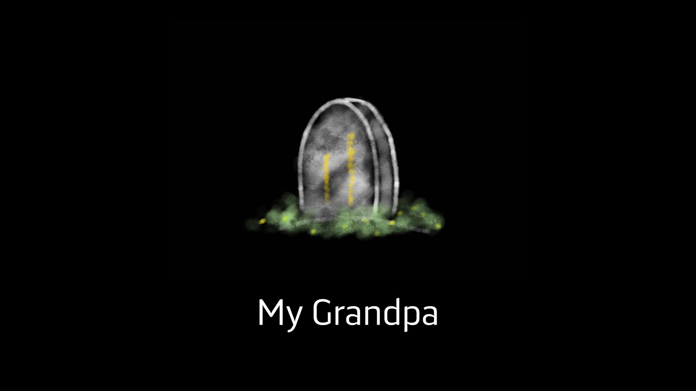

# My Grandpa

My Grandpa is a first-person hypertext interactive fiction about a girl trying to learn about her grandpa, who passed away years ago. The game is developed using Twine Engine. 

To play the interactive story, please download the latest version of zip files from [the release page](https://github.com/Xuefuguoalita/My-Grandpa/releases "My Grandpa release page"). 
